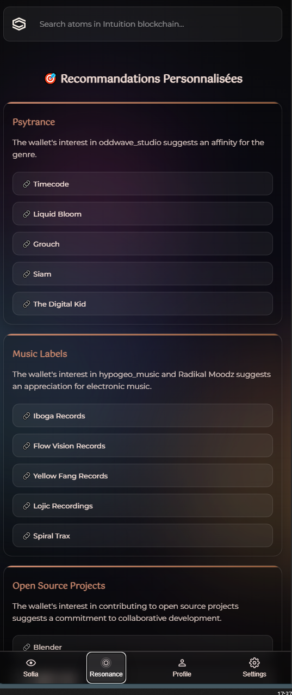

---

slug: logbook-10-10

title: Logbook 10/10

authors: [Samuel, Maxime]

---

This week we expanded SofIA’s intelligence layer by integrating Ollama for personalized recommendations and strengthening the search and indexing system for blockchain data.  

On the AI side, SofIA now features a complete recommendation engine capable of analyzing user on-chain activity and generating contextual suggestions. We implemented a double-pass strategy, producing a natural language response before reformatting it into structured JSON, and configured Ollama to accept secure requests directly from the Chrome extension. Results are now stored locally through IndexedDB, with automatic accumulation and deduplication to prevent redundant entries.  

On the blockchain side, we improved the search experience with EIP-55 normalization (via Viem) for wallet addresses, ensuring consistent query results. We also unified the search bar inside the SignalsTab and optimized GraphQL queries to fetch all triples where users hold positions, making blockchain exploration faster and more reliable.  

Together, these upgrades establish the foundation for adaptive, AI-driven insights within SofIA, linking behavioral patterns, blockchain data, and recommendation logic into one seamless experience.

<!-- truncate -->

## AI Recommendation System (Ollama)
- Integrated Ollama for intelligent, personalized suggestions and accept requests from the Chrome extension  
- Added double-pass generation (natural → JSON)  
- Enabled IndexedDB persistence with smart accumulation and deduplication  

## Search System Improvements
- Added EIP-55 normalization for wallet addresses (Viem)  
- Unified search bar within the SignalsTab  
- Optimized GraphQL queries for faster triplet retrieval  

## Overall Impact
- Full AI recommendation engine operational  
- Enhanced UX fluidity through local caching  
- More reliable blockchain search and normalized data  
- A key milestone toward a self-learning SofIA ecosystem

