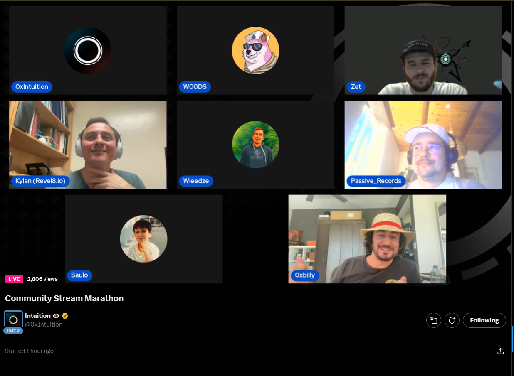
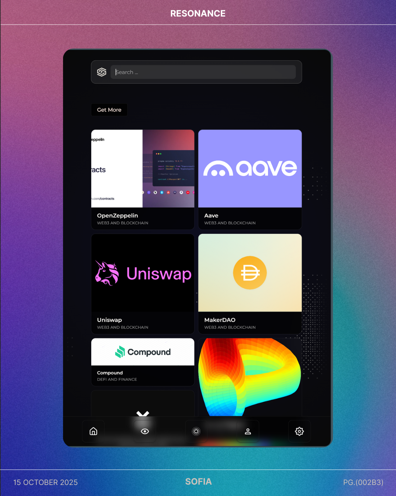
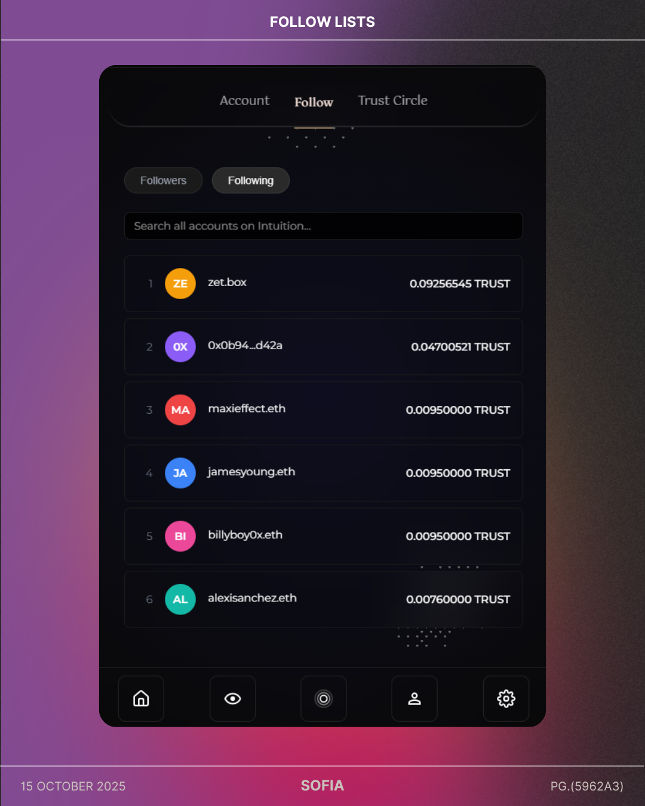

---

slug: logbook-17-10

title: Logbook 17/10

authors: [Samuel, Maxime]

---

This week marked a major milestone for Sofia: our first public demo at Intuition's X Space, alongside significant improvements across recommendation intelligence, UI/UX redesign, and community expansion.

On the AI front, we integrated Ollama to power our recommendation engine, delivering smarter, context-aware suggestions. The Resonance page now provides high-quality website recommendations, transforming how users discover relevant content based on their on-chain activity.

On the design side, we completely revamped the website's UI/UX and refined the extension interface to align with our visual identity. We also improved the orb animation on the homepage, creating a more polished and engaging landing experience.

Most importantly, we presented Sofia publicly for the first time during Intuition's community stream. The feedback was incredibly positive, and seeing real users interact with Sofia was both rewarding and inspiring. We also launched our Discord server and opened the early access program to contributors, building momentum toward a vibrant, collaborative ecosystem.

Together, these updates represent a turning point: Sofia is evolving from an internal project into a public-facing product with a growing community behind it.

<!-- truncate -->

## Public Demo & Community Launch
- Launched the official Discord server
- Opened the early access program to contributors
- Presented Sofia publicly on Intuition's X Space community stream
- Received encouraging user feedback and engagement

[Watch the full stream](https://x.com/i/broadcasts/1ypJdqnZEQyxW?t=5820)

## OLLAMA Integration for Recommendations
- Integrated Ollama to handle intelligent, personalized recommendations
- Resonance page now delivers accurate website suggestions based on user behavior

## Community & Product Pages
- Improved Follow, Trust Circle, and Account pages with better usability

## UI/UX Overhaul
- Complete redesign of the website's interface and user experience
- Updated extension UI to match the new visual identity
- Enhanced homepage orb animation for a more dynamic presentation

## Overall Impact
- First public showcase: validation from real users
- Major design consistency across platform and extension
- Enhanced recommendation quality with Ollama integration
- Community foundation established with Discord and contributor access
- A critical step toward building Sofia as a collaborative, user-driven ecosystem

