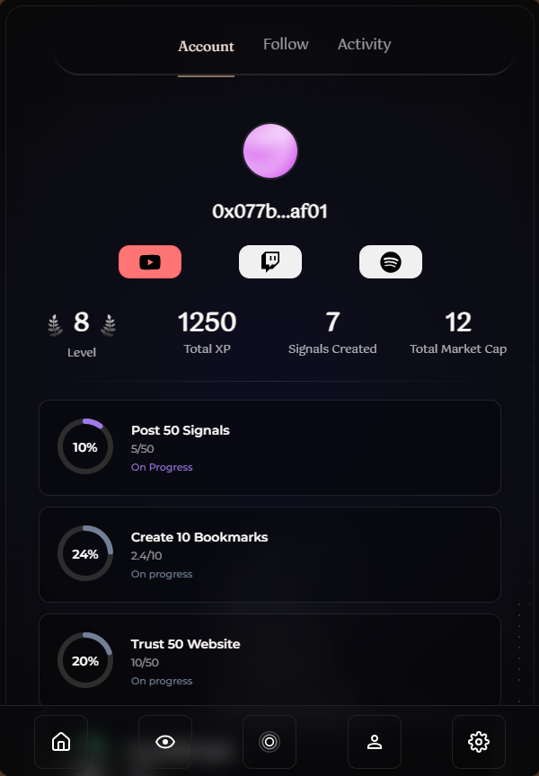
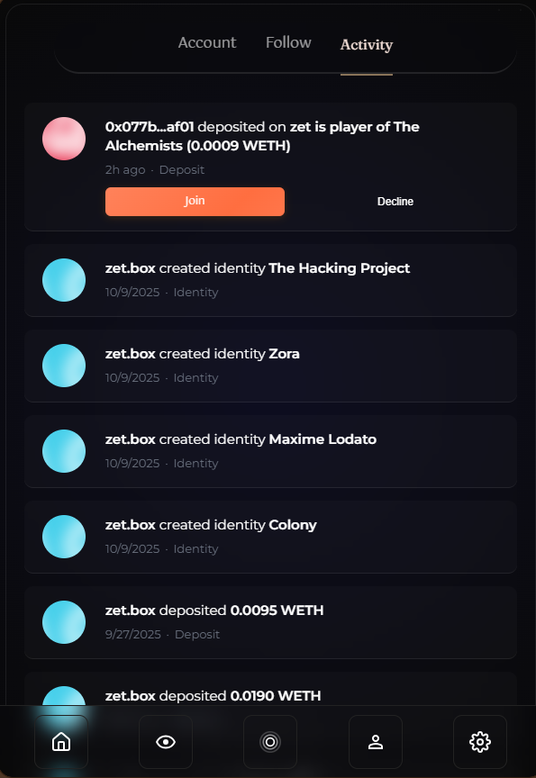
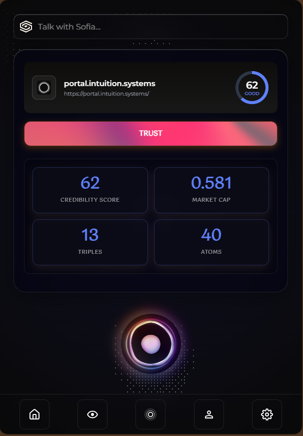

---

slug: logbook-24-10

title: Logbook 24/10

authors: [Samuel, Maxime]

---

This week we completed managed hosting, opened the first round of public testing, and introduced several key improvements to the Trust system and account experience.

On the infrastructure side, Sofia’s environment is now fully managed and Alpha-ready — a critical milestone toward stability and scalability. This new setup allows us to continuously monitor multi-agent configurations with ease, ensuring smoother testing and faster iteration cycles.

From a design perspective, this week brought a major UI and UX update to the Account page. Profiles now include Follow and Trust actions, detailed metrics, and a new Level Progress design that visualizes your growth and engagement over time. The homepage also introduces the new “Trust this site” component — enabling anyone to trust a webpage instantly, and view which triples and atoms are present on it.

We’ve also refreshed several core components — including the Amplify and Connect Wallet buttons — to make the interface more cohesive across the entire extension.

The new “Trust this site” component marks an important evolution in how Sofia connects browsing and trust. Directly from the homepage, users can now trust any webpage on the fly, without leaving their navigation flow. The component also reveals which triples and atoms are present on the page, allowing users to see the underlying semantic structure behind what they’re trusting. This feature bridges the gap between exploration and validation — turning every visit into an opportunity to expand the web of trusted knowledge.

Altogether, these updates bring Sofia closer to a dynamic, user-driven ecosystem where trust, identity, and discovery seamlessly converge. The foundation is stronger than ever — and with user testing now open, we’re ready to take the next leap toward Sofia’s public Beta.

<!-- truncate -->

## Managed Hosting & Deployment

- Sofia’s hosting is now **fully managed** and production-ready  
- Secure infrastructure with **Dockerized agents** and **automated releases**  
- Environment optimized for **continuous testing and iteration**

We’re officially **ready for user testing!**  
If you’d like to be part of the first Alpha testers, please **submit your request here:**  
➡️ [**Early Access Program**](https://tally.so/r/n9bvrY)

---

## UI / UX Enhancements

We’ve reimagined the **Account page** to make it more intuitive and social:

- New **Follow / Trust** actions directly on profiles  
- Improved **metrics visualization** for your activity and reputation  
- Added a **Level Progress Design** to visualize your growth and engagement  
- Refined interactions and improved UI consistency  

---

## Trust System Expansion

A new **“Trust this site”** component has been added to the homepage:

- Instantly **trust any webpage on the fly**  
- See which **triples** and **atoms** are present on the page  
- Strengthens the link between web browsing and the semantic Trust graph  

This brings trust creation directly into your browsing experience — seamlessly integrated with Sofia.

---

## Component & Design Updates

- **Amplify button redesigned** for better readability and balance  
- **Connect Wallet button updated** with new hover and feedback states  
- Improved consistency and micro-animations across key components  

---

## What’s Next

- Collecting and analyzing **feedback from early testers**  
- Expanding **Trust Circle** interactions within the Account view  
- Adding real **analytics and insights** to the metrics dashboard  

---

Sofia continues to evolve with every iteration — from infrastructure to interaction.  
Thanks to everyone building, testing, and trusting with us.

