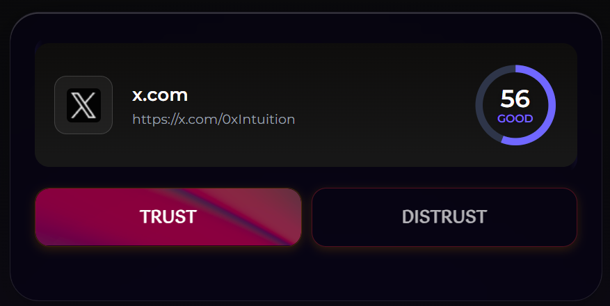

---

slug: logbook-12-12

title: Logbook 12/12

authors: [Samuel, Maxime]

---

This week focused on core foundational deliveries, including connecting the MCP Server to our agent and deploying the full Privy authentication flow for the Chrome extension. We also finalized the staking modal (with bonding curve options), optimized transactions using Sofia’s fee proxy, extended the Trust / Distrust system, and improved data integrity and UX reliability across triples creation and display.These features are not yet available to the public and will be pushed to production for alpha V2.

<!-- truncate -->

## MCP Server Integration
We established a connection with the **Intuition MCP Server** and started defining the specific calling functions needed to make the best use of this link.

## Authentication & Privy Integration
The **Privy authentication flow** is now fully implemented in the Chrome extension.  
We integrated the **Privy wallet provider** and added a [dedicated login component](https://sofia.intuition.box/auth)
The provider is now configured with the correct environment and security settings.

## Transactions & Staking
The **staking modal** is now fully functional, allowing users to stake through a clear and reliable process by choosing between offset-progressive or linear bonding curves.  
We also improved transaction handling by adding a deposit function when triples already exist, enabling users to stake on existing claims.  
In parallel, the proxy contract is now live, and a transaction-wrapping function has been implemented for triple creation and staking to optimize gas usage and Sofia’s fees.

## Trust / Distrust System
We extended the trust system by introducing a **distrust address constant**, allowing users to create claims such as **“I distrust "object"”**.  
The trustPage component was updated to support this new feature.

## Triples Generation Improvements
We fixed triple duplication issues in the UI using a hash-based deduplication system.  
Each triple now receives a unique key based on its exact name, and existing keys are checked in local storage before saving.