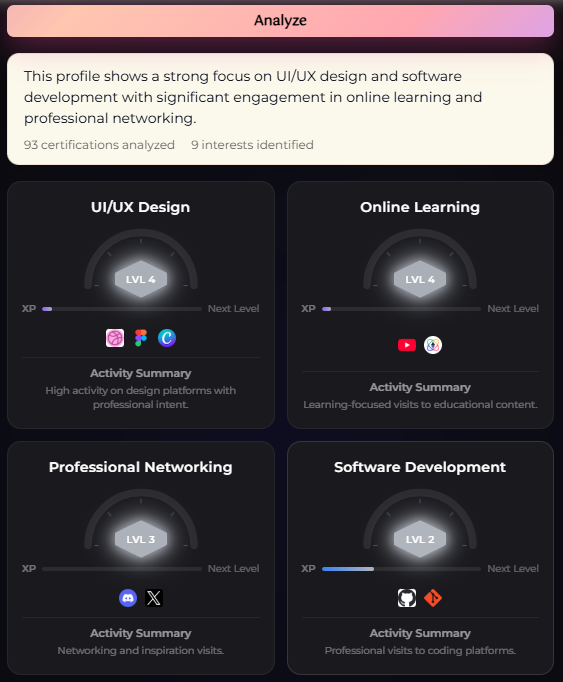

# Interest Analysis

**Interest Analysis** categorizes your on-chain [certifications](../features/certifications.md) into interest areas, building your expertise profile.

## How It Works

The AI analyzes your **existing certifications** (not your browsing) to identify patterns and categorize your interests.

## Interest Profile View

## Sharing

You can share your interest profile on X/Twitter with an auto-generated OG image.
