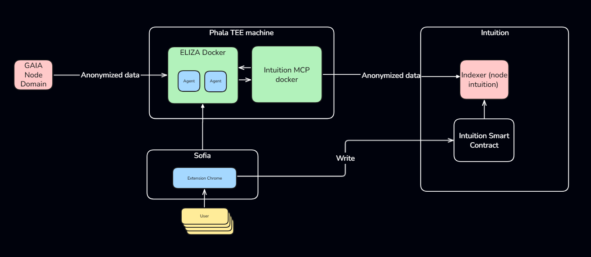

# Architecture Overview

Sofia's architecture is designed around privacy, decentralization, and verifiable knowledge. The system ensure your data remains private while providing powerful AI-driven insights.

## Architecture Diagram

The Sofia architecture consists of several interconnected layers.

## Key Components

### Chrome Extension (User Layer)

The Sofia Chrome Extension is your gateway to the system. It monitors your browsing activity, capturing URLs and context to build your personal knowledge graph. The extension runs locally in your browser, ensuring initial data capture happens on your device.
All the data are stored into your localstorage and sent excusively to Phala TEE Machine to insure your complete privacy. 

### Phala TEE Machine (Privacy Layer)

All sensitive data processing happens within a Trusted Execution Environment (TEE) powered by Phala. This ensures that your browsing data is processed in a secure, isolated environment where even the infrastructure provider cannot access your raw data.

Our core values emphasize end-to-end encrypted data certification, ensuring that all information remains protected from the moment it is created until it is processed. We also provide public verification of data encryption through on-chain attestations, offering full transparency and trust.

Our ultimate intention is to guarantee users true decentralization — even we have no access to the data that transits within the TEE.

### Mastra Framework Docker

Mastra framework run within the TEE, analyzing your browsing patterns and generating insights. These AI agents are trained to understand context, extract meaningful signals, and create connections in your knowledge graph – all while respecting your privacy.

### GaiaNet (AI Models)

GaiaNet provides decentralized AI models that powers Sofia's intelligent features. The anonymized data come from Phala, and processed by Gaianet which ensure the scalability of our infrastucture. 

### Intuition MCP & Indexer (Knowledge Layer)

The intuition MCP is executed throught the TEE. Sofia agent's are connected to the MCP server which query and filter the user knowledge graph. 

## Data Flow

1. **Capture:** Your browsing activity is captured by the Chrome Extension
2. **Process:** Data is sent to Phala TEE for secure processing
3. **Analyze:** ELIZA agents analyze patterns and generate insights within the TEE
4. **Anonymize:** Processed data is anonymized before leaving the TEE
5. **Index:** Anonymized signals are indexed on-chain through Intuition
6. **Query:** Interaction are made throught the smart contract
