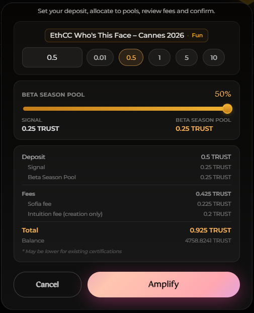

# Certifications

A **Certification** is the act of committing a page visit to the blockchain with an [Intention](./intentions.md) and a TRUST deposit.

## Certification Flow

## Certification Details

When you certify, you configure:

| Parameter | Description | Default |
|-----------|-------------|---------|
| **Amount** | TRUST tokens to deposit | 0.01 TRUST |
| **Pool Split** | % going to Beta Season Pool | 20% |
| **Intention** | Your reason for visiting | Required |

## What Happens On-Chain

1. **[Atom](../core-concepts/atoms.md) Creation**: URL atom created (if new)
2. **[Triple](../core-concepts/triples.md) Creation**: Subject-Predicate-Object relationship
3. **Deposit**: TRUST tokens locked in vault
4. **Shares**: You receive vault shares

## Re-Certifying

You can add more weight to existing certifications:
- **Same intention**: Increases your stake
- **Different intention**: Creates a new triple

## The Weight Modal

The **Weight Modal** appears when you certify, showing all transaction details:

### Understanding Fees

| Fee Type | Description |
|----------|-------------|
| **Protocol Fee** | Intuition network fee (0.2 TRUST)|
| **Sofia Fee** | Platform fee (5% + 0.01 TRUST) |
| **Gas** | Blockchain transaction cost |
