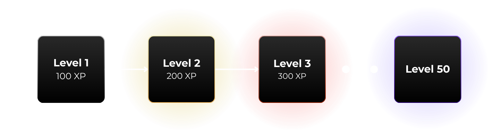
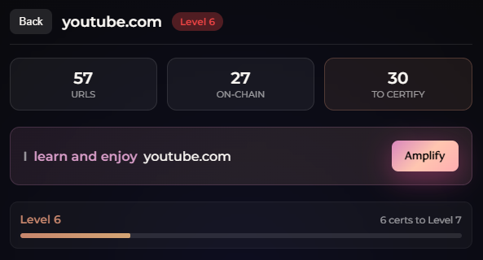

# Currencies & Levels

Sofia transforms knowledge certification into an engaging game with multiple progression systems.

## Currencies

Sofia has two distinct currencies:

### XP (Experience Points)

| Property | Description |
|----------|-------------|
| **Source** | Earned from completing [quests](./quests-discovery.md) |
| **Purpose** | Determines your user level |
| **Storage** | On-chain (verifiable) |
| **Tradeable** | No |

### Gold

| Property | Description |
|----------|-------------|
| **Source** | [Certifications](../features/certifications.md) (+10), [Discovery](./quests-discovery.md) bonuses, [Voting](./streaks-voting.md) (+5/vote) |
| **Purpose** | Spent on domain level-ups |
| **Storage** | Off-chain (local) |
| **Tradeable** | No |

Gold formula: `totalGold = certificationGold + discoveryGold + voteGold - spentGold`

---

## User Levels

Your overall level reflects your engagement with Sofia:

### Level Benefits

Higher levels unlock:
- Profile badges
- Community recognition

---

## Domain Levels

Each domain (website) you certify has its own level (1-10):

### Leveling Up Domains

To level up a domain:
1. Reach the certification threshold
2. Spend **Gold** to confirm the level-up
3. Receive XP bonus

### Level Thresholds

Certification thresholds: `[0, 3, 7, 12, 18, 25, 33, 42, 52, 63, 75]`

| Level | Certifications Required | Gold Cost |
|-------|------------------------|-----------|
| 1 → 2 | 3 | 30 Gold |
| 2 → 3 | 7 | 50 Gold |
| 3 → 4 | 12 | 75 Gold |
| 4 → 5 | 18 | 100 Gold |
| 5 → 6 | 25 | — |
| 6 → 7 | 33 | — |
| 7 → 8 | 42 | — |
| 8 → 9 | 52 | — |
| 9 → 10 | 63 | — |
| 10 → 11 | 75 | — |
