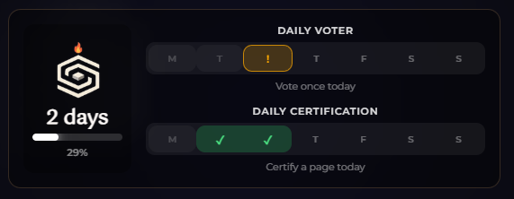

# Streaks & Voting

## Streaks

Streaks reward consistent daily engagement.

### How Streaks Work

A streak increments each day you make **at least one [certification](../features/certifications.md)**. Missing a day resets your streak to zero.

### Streak Rewards

| Streak Length | Reward |
|---------------|--------|
| 1 days | +50 XP |

### Streak Display

Your current streak appears in your profile and dashboard:

Your streak count is visible on the **Resonance Leaderboard**, where users are ranked by their current streak length. See [Resonance - Streak Leaderboard](../resonance/leaderboard.md) for details.

### Streak Tips

- Even a small certification (0.01 TRUST) counts
- Weekend certifications are crucial — don't skip Saturday/Sunday

---

## Voting System

Participate in community decisions to earn Gold and XP.

### Vote Types

| Vote Type | Cost | Reward |
|-----------|------|--------|
| **Support/Oppose** on certifications | 1 TRUST (on-chain) | +5 Gold |
| **Support/Oppose** on claims | Custom TRUST | +5 Gold |

### Daily Limits
- **10 votes per day** maximum
- **50 Gold/day** cap from voting
- Each vote also contributes to the **Daily Voter** quest

### What You Can Vote On
- Other users' certifications
- [Sofia Claims and Featured Claims](../resonance/vote.md)
- [Featured Lists](../resonance/featured-lists.md) entries
