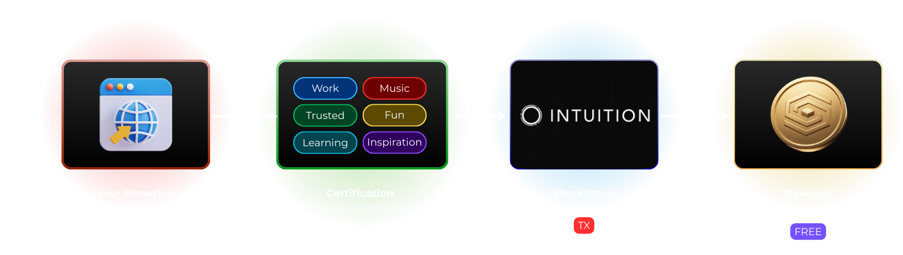

import DocCard from '@site/src/components/docs/DocCard';
import DocCardGrid from '@site/src/components/docs/DocCardGrid';
import FlowDiagram from '@site/src/components/docs/FlowDiagram';
import StatBox from '@site/src/components/docs/StatBox';

# What is Sofia?

**Sofia** (Semantic Organization for Intelligence Amplification) is a Chrome browser extension that transforms your everyday web browsing into verifiable, blockchain-certified knowledge.

## The Vision

In a world overflowing with information, Sofia helps you:

- **Certify** your knowledge in a verifiable way
- **Build** a decentralized expertise profile
- **Earn** rewards and interest for your participation
- **Contribute** to a shared knowledge graph

## How It Works

Sofia bridges your personal web activity with the **Intuition Protocol**, a decentralized knowledge graph where every certification becomes an immutable record.



When you certify a webpage, Sofia creates a **semantic triple** — a relationship between you, your intention, and the content:

```
[You] → [visits for learning] → [docs.python.org]
```

This triple is permanently stored on the Intuition blockchain, proving your interaction with that content.

## Key Features at a Glance

<DocCardGrid columns={2}>
  <DocCard title="Echoes" description="Your browsing history intelligently grouped by domain" />
  <DocCard title="Certifications" description="On-chain proofs of your web interactions" />
  <DocCard title="8 Intentions" description="Work, Learning, Fun, Inspiration, Buying, Music, Trusted, Distrusted" />
  <DocCard title="61 Quests" description="Gamified challenges to earn XP and Gold" />
  <DocCard title="Resonance" description="Vote on certifications, debate claims, explore trending pages" />
  <DocCard title="Pulse Analysis" description="AI extracts signals from your open tabs" />
  <DocCard title="Interest Analysis" description="AI categorizes your certifications into expertise areas" />
  <DocCard title="Trust Circle" description="Follow users and stake on their expertise" />
  <DocCard title="Chat with Sofia" description="Conversational AI assistant that knows your activity" />
</DocCardGrid>

## The Knowledge Economy

Thanks to Intuition Sofia can introduces a token-based economy where your attention has value:

<DocCardGrid columns={4}>
  <StatBox value="TRUST" label="Stake tokens" />
  <StatBox value="XP" label="Experience" />
  <StatBox value="Gold" label="Off-chain currency" />
  <StatBox value="+50" label="Pioneer bonus" />
</DocCardGrid>

---

## Documentation Menu

<DocCardGrid columns={2}>
  <DocCard title="Core Concepts" description="Atoms, Triples, Vaults — the blockchain building blocks" href="./core-concepts/atoms" />
  <DocCard title="Features" description="Echoes, Intentions, Certifications, Bookmarks" href="./features/getting-started" />
  <DocCard title="Gamification" description="XP, Gold, Quests, Levels, Streaks, Discovery rewards" href="./gamification/currencies-levels" />
  <DocCard title="AI Features" description="Pulse Analysis, Interest Analysis, Chat with Sofia" href="./ai-features/pulse-analysis" />
  <DocCard title="Resonance" description="Circle Feed, Trending, Vote/Debate, Claims, Leaderboards" href="./resonance/circle-feed" />
  <DocCard title="Social" description="Verification, Trust Circle, Following" href="./social/verification" />
  <DocCard title="Known Issues" description="Current limitations and workarounds" href="./known-issues/transactions" />
  <DocCard title="Litepaper" description="Vision, economic model, governance and privacy" href="./litepaper/introduction" />
  <DocCard title="Architecture" description="Technical overview of Sofia's stack" href="./architecture/overview" />
  <DocCard title="Ecosystem" description="Intuition, Phala, GaiaNet, Mastra — the partners" href="./ecosystem/intuition" />
</DocCardGrid>

---

:::note
Sofia is currently in alpha. To request access, [fill out this form](https://tally.so/r/7RdaeR).
:::
