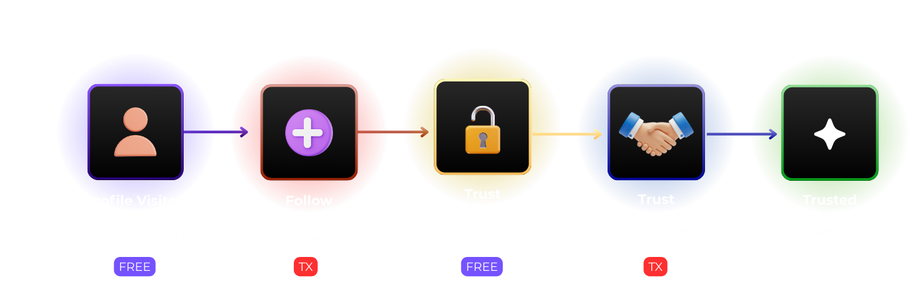

# Following & Trust Circle

## Following System

Follow other users to track their [certifications](../features/certifications.md) and build your network.

### How Following & Trust Works

## Trust Circle

The **Trust Circle** is an on-chain way to vouch for other users by staking TRUST tokens.

### How Trust Circle Works

When you add someone to your Trust Circle:
1. You deposit TRUST tokens on the Triple Vault (I - Trust - Wieedze.eth)
2. You receive shares
3. Your stake shows public support for them
4. You can redeem later (potentially with gains)
5. Their certifications appear in your **[Resonance Circle Feed](../resonance/circle-feed.md)**

---

:::tip Building Reputation
Your on-chain reputation grows with every certification, every follower, and every successful curation. Consistency and quality matter more than quantity.
:::
